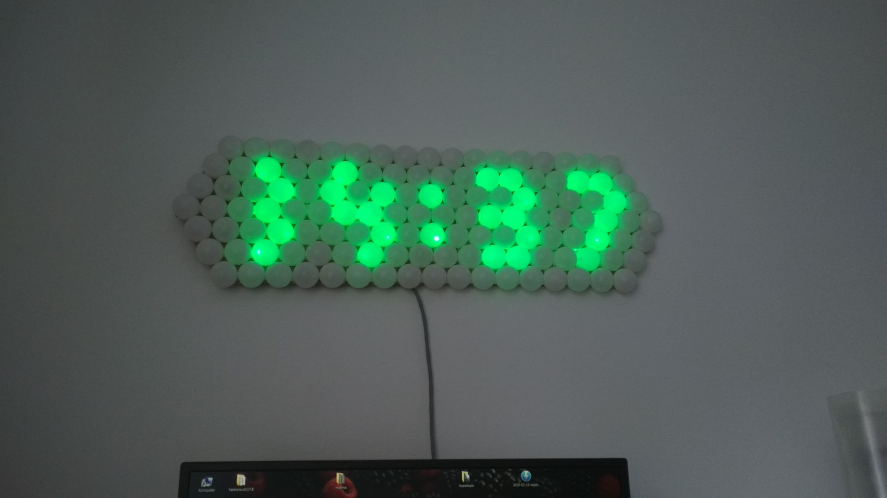

# PingPong LED display

## v2.0

Currently working on it...

### 🕹️ Controls

**🕒 Screen: TIME**

- `A`: Toggle **Auto Brightness**
- `B`: Toggle **Backlight**
- `C`: Toggle **Background Animation**
- `D`: Next Screen

**⚙️ Screen: SETTINGS**

- `A`: Submenu — **Color**
- `B`: Submenu — **Brightness**

  — `A`: Set current color as **Text Color**.  
  — `B`: Set current color as **Background Color**.  
  — `*`: Confirm number input for R/G/B and switch to next color

- `C`: Submenu — **Time**
- `D`: Next Screen

**✨ Screen: ANIMATION**

- `A`: Next animation (+1)
- `B`: Previous animation (-1)
- `*`: Confirm number input (0–100)
- `#`: Clear input
- `D`: Next Screen

## About v1.1

The display is made with ping pong balls (actually halves of them), backlit with WS2812 diodes. Usually it shows the current time, read from a DS1307 real-time clock. The module has a small battery so the clock keeps time when external power is removed. The display can show simple animations and there is a work-in-progress game inspired by the Chrome dinosaur game. Everything runs on an ATmega328. The controller box has buttons to change modes (Time, Animations, Timer, Dino-game), edit colors, and adjust brightness.

More info: https://jakubkivi.github.io/#modalOpen

