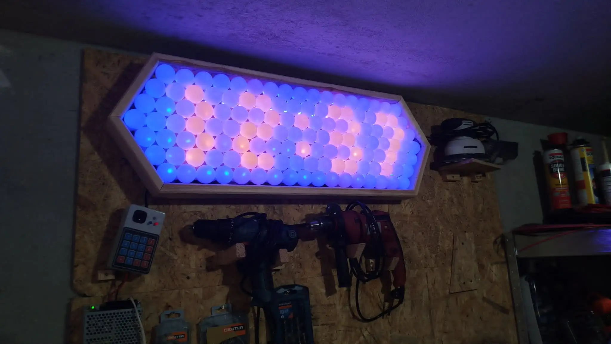

# PingPong LED display

This is version 2.0 of my PingPong Clock, featuring several upgrades over the original. The core display still uses WS2812 diodes to backlight halved ping pong balls and runs on an ATmega328, but the physical build now has a proper frame. The user experience and controls got a complete overhaul with a new menu system and keypad layout. I've also added an auto-brightness feature which is super useful in my workshop, where I placed this revived project.

### 🕹️ Controls

**🕒 Screen: TIME**

- `A`: Toggle **Auto Brightness**
- `B`: Toggle **Backlight**
- `C`: Toggle **Background Animation**
- `D`: Next Screen

**⚙️ Screen: SETTINGS**

- `A`: Submenu — **Color**
 
  — `A`: Set current color as **Text Color**.  
  — `B`: Set current color as **Background Color**.  
  — `*`: Confirm number input for R/G/B and switch to next color
  — `#`: Clear input
  
- `B`: Submenu — **Brightness**
- `C`: Submenu — **Time**
- `D`: Next Screen

**✨ Screen: ANIMATION**

- `A`: Next animation (+1)
- `B`: Previous animation (-1)
- `*`: Confirm number input (0–100)
- `#`: Clear input
- `D`: Next Screen

More info: 
https://jakubkivi.github.io/#portfolio-modal-pong

Based on a project by  <a href="https://www.instructables.com/Ping-Pong-Ball-LED-Clock/#" target="_blank">thomasj152</a>.
